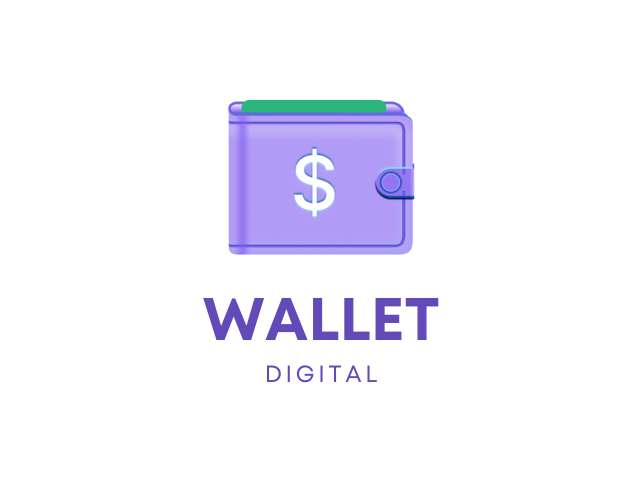

# Digital Wallet
<p align="center">
   
</p>

<p align="center">	
   <a href="https://www.linkedin.com/in/marcusrodriguesdev">
      
   </a>
  
</p>

<p align="center">	
  <a href="https://github.com/marcusrodriguesdev/digital-wallet/commits/main">
    
  </a> 
  
  <a href="https://github.com/marcusrodriguesdev/digital-wallet/stargazers">
    
  </a>
</p>


# ⭐ Summary

* [Description](#description)
* [Application Demo](#application-demo) 
* [My Steps](#my-steps)
* [Technologies](#technologies)
* [How to run the project](#how-to-run-the-project)
* [Found some bug?](#problems)
* [License](#license)

# Description
Digital Wallet is a financial control tool, where you can add your inputs and outputs very easily.

# Application Demo
Project not yet deployed!!

# My Steps
To prepare the project, I chose to use Typescript together with React, to facilitate development with object types.

I also chose to use the ESLINT tool, to standardize all my code in the same coding style, in this way, all the code is more readable for reading as it will always follow the same pattern.

To make styling easier, I used the styled-components library, so I could patronize my entire project by creating a dark theme, also making it easier to solve complex styling problems

I used the react testing library for unit testing, ensuring 100% coverage to maintain all quality in the final delivery

# Technologies
The following technologies were used in this project:
* [React](https://pt-br.reactjs.org/)
* [TypeScript](https://www.typescriptlang.org/)
* [Styled-components](https://styled-components.com/)
* [Jest](https://jestjs.io/pt-BR/)

# How to run the project
```bash
# Copy repository
$ git clone 

# Install dependecies
$ npm install
or
$ yarn install

# Run application
$ npm start
ou
$ yarn start
```

Access: http://localhost:3000/

# Problems

If you found any bugs, feel free **to create a new issue**  [clicking here!](https://github.com/marcusrodriguesdev/digital-wallet/issues). If you already found the solution to the problem, **make a pull request**!

# License

Created in 2022


Developed with 💜 by [Marcus Rodrigues](https://www.linkedin.com/in/marcusrodriguesdev).

This project is about [MIT license](./LICENSE).
